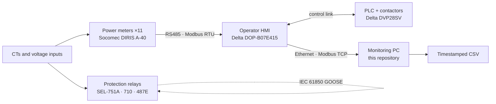

# Microgrid monitoring — PLC, HMI and Modbus data acquisition

A Python Modbus TCP client that pulls live electrical measurements out of a
laboratory microgrid and logs them to timestamped CSV, plus the engineering
notes from getting it to work.

Built during six weeks of practical training on a low-voltage teaching and
research microgrid at the University of Cape Town, June–July 2026.

---

## The problem

The microgrid already measured everything worth measuring. Eleven three-phase
power meters watched the feeders, an operator HMI polled them over a two-wire
RS485 bus, and a PLC drove the contactors. What none of it did was let you take
the numbers away — no historian, no export, nothing an external computer could
read.

So the question was not "how do I measure this", it was **how far can a
measurement actually travel** — from a current in a conductor, through a CT,
into a meter, across a serial bus, onto an operator screen, and out to a file
someone can analyse. This repository is the last link in that chain, and the
notes below are what I learned building it.

## The measurement chain



Two things in that diagram are worth pointing at.

**The HMI is not just a screen.** It is the Modbus RTU master for the whole
meter bus. Every measurement an operator sees has been polled by it, which makes
it both the display layer and the single point through which any external
reader has to go.

**The protection relays take their own CT inputs.** They are drawn off the same
CTs, not off the monitoring path. That separation turned out to be a design
decision worth defending rather than an accident — see below.

## How the logger gets its data

The obvious approach — have the external PC poll the meters directly — does not
work through the installed configuration. The meters sit behind the HMI on the
serial bus, and their registers are not reachable from the Ethernet side.

The route that does work is a hop:

1. A macro inside the HMI copies the meter values it has already polled into the
   HMI's own internal registers.
2. The Python client reads those internal registers over Modbus TCP.
3. It converts each raw value using the correct register type and scaling, then
   writes a timestamped row to CSV.

Step 3 is where the care goes. A Modbus register is sixteen bits of nothing in
particular until you know its type, its word order and its scale — the same
sixteen bits are a valid voltage, a nonsense current and a wildly wrong power
depending on how you read them. Every quantity gets converted against the
meter's documented register table, not by pattern-matching what "looks about
right".

## What it logs

Per meter, per sample: line-to-line voltages, phase voltages, phase currents,
frequency, three-phase active power, and power factor.

## What I found

The useful part of this work was not the script. It was four decisions where
the obvious answer was wrong.

**A communication alarm is not automatically a cable fault.** A persistent HMI
comm error looked like an RS485 problem, so I checked it as one — A/B polarity,
daisy-chain topology, termination, shielding, cable routing near high-current
conductors, station addresses, baud rate and serial parameters. The physical
layer was fine. The alarm was coming from a single numerical display object and
the register behind it, at the application layer. Checking the wiring first was
still right; concluding the wiring was the fault would not have been.

**Power factor came back unreliable**, so I stopped reading it and computed it
instead, as active power over apparent power. A derived value you understand
beats a reported value you do not trust.

**The update rate was a hardware limit, not a tuning problem.** The HMI's
background macro was updating so slowly it sometimes took minutes. Replacing it
with a clock macro on a short interval brought that down to roughly ten seconds
— and ten seconds was where it stopped, because that is what the HMI's scan and
processing speed allow. The fix improved the system and simultaneously showed me
the ceiling I had just hit. I reported both.

**Protection should not be fed through the monitoring path.** Current values
were already sitting in the HMI, so routing them onward to the protection relays
would have saved wiring. I rejected it. That path — CT to meter to HMI to
protocol conversion to relay — adds delay, makes protection depend on several
devices that can each fail independently, and inherits the same slow update
rate. Protection needs continuous, deterministic measurement; the relays keep
their direct CT inputs. A protocol gateway was considered as an alternative and
rejected too, because it moved the data faster without touching the underlying
latency problem.

## What this tool is not

It works, and it is bounded by the hardware it reads through. Roughly a ten
second update, because the HMI macro and scan rate say so. That is fine for
trend logging and load-behaviour studies; it is not fast enough for transient
capture, and it is nowhere near protection-grade.

For faster acquisition from this hardware the vendor's own server product is the
better layer, with a custom dashboard reading what it logs. I concluded that
after building this, not before — the Python route was the right way to
understand the system end to end and remains the right tool for custom work, but
being able to say which tool wins on speed required building both.

## Configuration is deliberately not in this repository

There are no station addresses, register offsets, coil addresses or
button-to-contactor mappings here. That mapping exists — producing it was part
of the work, and it is what makes the installation maintainable by whoever comes
next — but it lives with the laboratory, not on the public internet. A map of
which Modbus writes operate which switchgear is an operating document, not a
portfolio piece.

To run this against your own installation, supply your own register map from
your meter and HMI documentation.

## Running it

```sh
pip install pymodbus
python microgrid_meter_logging.py
```

Set the HMI's IP address, unit ID and register block at the top of the script.

---

**Lilitha Tsewu** — BSc (Eng) Mechatronics, University of Cape Town
